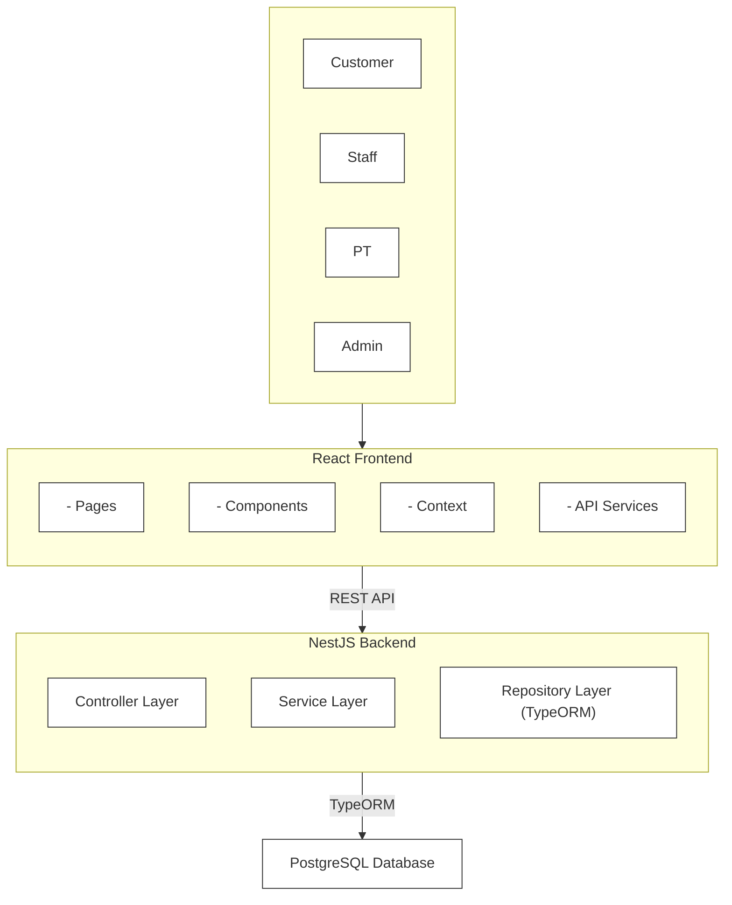

# Tài liệu Tổng hợp Kiểm thử (Comprehensive Testing Documentation)

Tài liệu này tổng hợp toàn bộ cấu trúc, công nghệ và các loại kiểm thử được thiết lập và sử dụng trong dự án ITSS (bao gồm cả Frontend và Backend).

---

## 1. Sơ đồ cấu trúc thư mục kiểm thử (Test Directory Structure)

Dưới đây là sơ đồ cấu trúc thư mục chứa các file kiểm thử trong dự án ITSS, cùng với mô tả chi tiết phân loại cho từng thành phần:

```text
ITSS/
├── frontend/
│   ├── test/
│   │   ├── mocks/
│   │   │   ├── handlers.ts     # Khai báo các mock endpoints của MSW (Mock Service Worker)
│   │   │   └── server.ts       # Thiết lập MSW server cho môi trường NodeJS (chạy test console)
│   │   └── setup.ts            # Môi trường test frontend (mock các browser APIs như router, matchMedia, v.v.)
│   ├── vitest.config.ts        # Cấu hình Vitest cho Next.js
│   └── app/
│       └── login/
│           └── __tests__/
│               └── page.spec.tsx  # Integration test cho trang đăng nhập Client (kiểm thử tương tác giao diện và Mock API)
└── backend/
    ├── test/
    │   └── auth.e2e-spec.ts    # E2E/Integration test kết hợp Testcontainers (kết nối DB PostgreSQL thật trong Docker container)
    ├── src/
    │   └── auth/
    │       └── auth.service.spec.ts  # Unit test kiểm thử logic độc lập của AuthService (mock UsersService, JwtService)
    └── package.json            # Cấu hình Jest Projects (Unit & E2E)
```

---

## 2. Phân loại các loại kiểm thử trong dự án (Test Types)

### 2.1. Unit Test (Kiểm thử đơn vị)
* **Định nghĩa:** Kiểm thử một hàm hoặc một lớp (Class) nghiệp vụ cụ thể trong điều kiện cô lập hoàn toàn. Mọi đối tượng phụ thuộc bên ngoài (Database, dịch vụ khác) đều được giả lập (mock) để tập trung kiểm tra logic xử lý của riêng nó.
* **Vị trí code cụ thể:**
  * **File:** [auth.service.spec.ts](file:///d:/ITSS/backend/src/auth/auth.service.spec.ts)
  * **Chi tiết:** Test này giả lập (mock) hoàn toàn `UsersService`, `JwtService` và thư viện `bcrypt`. Nó chỉ tập trung kiểm tra xem `AuthService` xử lý logic đăng ký, đăng nhập và đổi mật khẩu có đúng đắn hay không (ví dụ: trả về đúng token, ném ra lỗi phù hợp khi mật khẩu sai).

### 2.2. Frontend Integration Test (Kiểm thử tích hợp Component)
* **Định nghĩa:** Kiểm thử sự kết hợp của nhiều đơn vị UI component với nhau cùng với luồng dữ liệu (chẳng hạn tương tác giữa giao diện React với dịch vụ gọi API giả lập).
* **Vị trí code cụ thể:**
  * **File test:** [page.spec.tsx](file:///d:/ITSS/frontend/app/login/__tests__/page.spec.tsx)
  * **File Mock API:** [handlers.ts](file:///d:/ITSS/frontend/test/mocks/handlers.ts)
  * **Chi tiết:** Test này dựng giao diện thật của trang `LoginPage`, thực hiện điền form, bấm nút đăng nhập và dùng thư viện MSW (Mock Service Worker) để giả lập phản hồi của máy chủ HTTP. Nó kiểm tra xem giao diện có hiển thị đúng thông báo lỗi validate, toast thông báo thành công và chuyển hướng trang chính xác hay không.

### 2.3. End-to-End (E2E) Test / API Integration Test
* **Định nghĩa:** Kiểm thử luồng đi của dữ liệu xuyên suốt toàn bộ ứng dụng từ đầu vào (HTTP Request) qua các tầng xử lý (Controller, Service, Repository) đến đích cuối cùng là cơ sở dữ liệu thật (Database).
* **Vị trí code cụ thể:**
  * **File:** [auth.e2e-spec.ts](file:///d:/ITSS/backend/test/auth.e2e-spec.ts)
  * **Chi tiết:** Test này sử dụng `supertest` để tạo HTTP request giả lập gửi tới server NestJS thật. Đặc biệt, nó sử dụng thư viện `testcontainers` để tự khởi chạy một Database PostgreSQL thật bên trong Docker. Dữ liệu khi đăng ký sẽ thực sự được ghi vào DB PostgreSQL và test sẽ truy vấn trực tiếp vào DB đó để đối soát sự tồn tại của bản ghi.

---

## 3. Giải thích chi tiết các công nghệ kiểm thử (Testing Technologies)

### 3.1. Mock Endpoints (Đầu nối API ảo)
* **Khái niệm dễ hiểu:** Là các "đầu nối API ảo". Khi ứng dụng Client (Frontend) gửi các request HTTP (như GET, POST, PUT, DELETE) đến Server (Backend), thay vì gọi tới server thật, mock endpoints sẽ chặn request đó và trả về dữ liệu mẫu (mock data) được chuẩn bị trước.
* **Chi tiết code:** Định nghĩa tại [handlers.ts](file:///d:/ITSS/frontend/test/mocks/handlers.ts), dùng lệnh `http.post()` để chặn URL `/auth/login` và trả về mock JWT token cùng thông tin tài khoản admin khi người dùng gửi đúng credentials (`admin@gympro.com` / `Gympro@123`).

### 3.2. MSW (Mock Service Worker) Server cho môi trường NodeJS
* **Khái niệm dễ hiểu:** MSW là một thư viện chặn request mạng. Trên trình duyệt thật, MSW sử dụng *Service Worker* để chặn các request. Tuy nhiên, khi chạy các file test trong terminal (môi trường NodeJS), chúng ta không có trình duyệt và Service Worker. Vì vậy, tệp `server.ts` thiết lập một "MSW server ảo" chạy trong NodeJS để chặn các kết nối mạng `fetch` của component và định tuyến chúng đến các mock endpoints tương ứng.
* **Chi tiết code:** Định nghĩa tại [server.ts](file:///d:/ITSS/frontend/test/mocks/server.ts) thông qua hàm `setupServer(...handlers)` để tạo ra instance server chạy trên môi trường Node.js.

### 3.3. Môi trường Test Frontend (Mock Browser APIs)
* **Khái niệm dễ hiểu:** Môi trường test trên terminal sử dụng NodeJS (được mô phỏng DOM bằng thư viện `jsdom`). Môi trường này thiếu vắng rất nhiều chức năng có sẵn trên trình duyệt thật (như `window.matchMedia`, `window.localStorage`, hay các hàm chuyển hướng router của Next.js `useRouter`). Tệp `setup.ts` đảm nhận nhiệm vụ giả lập (mock) các API trình duyệt này.
* **Chi tiết code:** 
  * Cài đặt tại [setup.ts](file:///d:/ITSS/frontend/test/setup.ts).
  * `beforeAll`, `afterEach`, `afterAll` điều khiển bật/tắt/reset máy chủ MSW.
  * `Object.defineProperty(window, 'matchMedia', ...)` tránh lỗi tương thích của các UI components (như RadixUI).
  * `localStorageMock` giả lập bộ nhớ tạm thời bằng RAM để lưu trữ token đăng nhập.
  * `vi.mock('next/navigation', ...)` mock NextJS router để kiểm tra hành vi gọi `router.push('/admins')`.

### 3.4. Vitest
* **Khái niệm dễ hiểu:** Vitest là một thư viện chạy kiểm thử (Test Runner) thế hệ mới cực kỳ nhanh, được phát triển trên nền tảng Vite. Nó tương thích ngược với hầu hết cú pháp của Jest nhưng có tốc độ khởi chạy và cập nhật (hot reload) nhanh hơn rất nhiều lần.
* **Chi tiết cấu hình:** Thiết lập tại [vitest.config.ts](file:///d:/ITSS/frontend/vitest.config.ts) để chạy kiểm thử cho các component phía client (Next.js).

### 3.5. Jest
* **Khái niệm dễ hiểu:** Jest là một khung kiểm thử (Test Framework) vô cùng nổi tiếng và lâu đời của Facebook dành cho JavaScript/TypeScript. Nó cung cấp đầy đủ các công cụ từ viết ca kiểm thử (`describe`, `it`, `expect`), giả lập hàm (`jest.fn()`), cho đến xuất báo cáo độ bao phủ code (code coverage).
* **Chi tiết cấu hình:** Sử dụng ở phía Backend (NestJS), chạy thông qua lệnh `jest --selectProjects unit` hoặc `jest --selectProjects e2e`.

### 3.6. Testcontainers & Docker (Chỉ dùng ở Backend E2E)
* **Khái niệm dễ hiểu:** Khi test E2E, ta cần một DB thật hoàn toàn cô lập để ghi/đọc dữ liệu mà không làm ảnh hưởng đến DB phát triển (development). `Testcontainers` tự động kết nối với Docker trên máy để tải ảnh (image) `postgres:15-alpine` về, khởi tạo một container chứa DB PostgreSQL thật khi chạy test, và tự động hủy bỏ container này khi test kết thúc.
* **Chi tiết code:** Cấu hình trong [auth.e2e-spec.ts](file:///d:/ITSS/backend/test/auth.e2e-spec.ts).

### 3.7. Supertest (Chỉ dùng ở Backend E2E)
* **Khái niệm dễ hiểu:** Dùng để giả lập và gửi các request HTTP thật (như GET, POST) trực tiếp đến NestJS Application (`app.getHttpServer()`) để kiểm thử phản hồi của các Controller API.

### 3.8. React Testing Library (RTL)
* **Khái niệm dễ hiểu:** Là một thư viện hỗ trợ kiểm thử giao diện React bằng cách tập trung vào **trải nghiệm thực tế của người dùng** (User-centric) thay vì kiểm thử cấu trúc code bên trong (implementation details). RTL giúp chúng ta kiểm tra xem "người dùng có nhìn thấy thông tin lỗi trên màn hình hay không" thay vì "state của component có thay đổi đúng hay không".
* **Chi tiết code:** Được sử dụng trực tiếp trong [page.spec.tsx](file:///d:/ITSS/frontend/app/login/__tests__/page.spec.tsx) thông qua các hàm:
  - `render(<LoginPage />)`: Vẽ component ra môi trường DOM ảo.
  - `screen.getByPlaceholderText(...)`, `screen.getByRole(...)`: Tìm các thành phần UI trên màn hình (nhập liệu, nút bấm).
  - `fireEvent.change(...)`, `fireEvent.click(...)`: Mô phỏng hành động nhập liệu hoặc click chuột của người dùng.
  - `waitFor(...)`: Chờ đợi UI cập nhật sau các tác vụ bất đồng bộ (như chờ API phản hồi).

---

## 4. Hướng dẫn chạy các lệnh kiểm thử (Running Tests)

### 4.1. Ở Frontend (Vitest)
Di chuyển terminal vào thư mục `frontend/` và chạy:
* **Chạy tất cả test:**
  ```bash
  npm run test
  ```
* **Chạy riêng một file test cụ thể:**
  ```bash
  npm run test app/login/__tests__/page.spec.tsx
  ```

### 4.2. Ở Backend (Jest)
Di chuyển terminal vào thư mục `backend/` và chạy:
* **Chạy các Unit test:**
  ```bash
  npm run test
  ```
* **Chạy các E2E test (Yêu cầu Docker Desktop phải được bật):**
  ```bash
  npm run test:e2e
  ```

---

## 5. Mô hình Kiến trúc Hệ thống (System Architecture Model)

### 5.1. Thiết kế kiến trúc (Architectural Design)
Dưới đây là sơ đồ **Mô hình Client-Server và kiến trúc đa tầng (Layered Architecture)** được áp dụng trong dự án. Sơ đồ này mô phỏng chuẩn cấu trúc phân lớp từ slide thuyết trình của Đại học Bách Khoa Hà Nội (HUST) nhưng được cập nhật chính xác theo stack công nghệ thực tế của dự án (**React Frontend, NestJS Backend & TypeORM** kết nối **PostgreSQL Database**):



### 5.2. Giải thích chi tiết các tầng trong mô hình:

1. **Tầng Người dùng (Clients / Actors):**
   * Gồm các vai trò tương tác chính với hệ thống: **Customer** (Hội viên), **Staff** (Nhân viên), **PT** (Huấn luyện viên cá nhân), và **Admin** (Quản trị viên).

2. **Tầng Giao diện (React Frontend):**
   * **Pages:** Các màn hình hiển thị chính (Login, Quản lý trang thiết bị, Quản lý hội viên, v.v.).
   * **Components:** Các phần tử UI nhỏ hơn để tái sử dụng (Bảng biểu, Nút bấm, Ô nhập liệu, Popup thông báo).
   * **Context:** Quản lý trạng thái dùng chung cho toàn bộ app (VD: lưu thông tin đăng nhập và token).
   * **API Services:** Các hàm gọi HTTP client để giao tiếp với máy chủ Backend.

3. **Cầu nối REST API:**
   * Chuẩn giao tiếp gửi nhận dữ liệu JSON giữa Frontend (Client) và Backend (Server).

4. **Tầng Xử lý Nghiệp vụ (NestJS Backend - Layered Architecture):**
   * **Controller Layer:** Điểm tiếp nhận request từ client, thực hiện routing và kiểm tra tính hợp lệ sơ bộ của dữ liệu (validation).
   * **Service Layer:** Chứa toàn bộ logic nghiệp vụ cốt lõi của ứng dụng (đăng ký thẻ, chấm công nhân viên, tạo ca tập, v.v.).
   * **Repository Layer (TypeORM):** Thực hiện tương tác trực tiếp với Database thông qua thư viện ORM (TypeORM) để truy vấn hoặc cập nhật dữ liệu.

5. **Tầng Cơ sở dữ liệu (PostgreSQL Database):**
   * Nơi lưu trữ dữ liệu có cấu trúc của hệ thống. Đồng bộ dữ liệu thông qua các kết nối do TypeORM quản lý.

